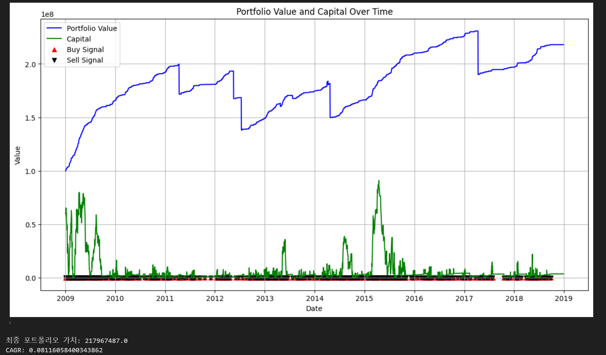
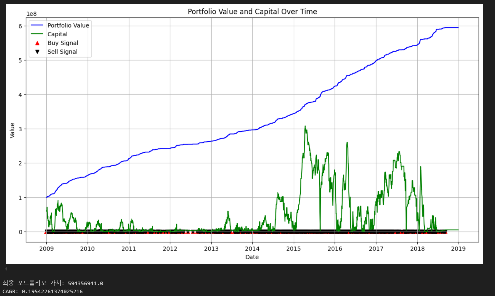

# Split_Investment_Strategy_Optimizer
한번수정해야할듯 
## 개요

이 프로젝트는 매직스플릿(MagicSplit) 매매법을 백테스팅하고, 최적의 투자 전략을 도출하여 실제 투자에 적용하는 것을 목표로 함. 매직스플릿 매매법은 특정 주식이나 ETF의 가격이 일정 비율로 하락했을 때 분할 매수하고, 일정 비율로 상승했을 때 분할 매도하는 전략. 이를 통해 리스크를 관리하고 최고 성과를 보이는 파라미터 조합을 찾는 것을 목표로 함

## 주요 기능
### 1. 종목 및 ETF 데이터 수집
- `stock_etf_data_collector.ipynb` 노트북을 통해 주식 및 ETF의 가격 데이터를 수집.
- 데이터는 MySQL 데이터베이스에 저장됩니다.
    - PER, PBR, 배당수익률 등의 조건을 만족하는 종목만 저장
    - 이미 처리된 종목을 기록하고 중복 처리를 방지
    - 상장폐지된 종목 및 조건을 만족하지 않는 종목 필터링
- 주식 및 ETF의 종목 리스트는 효율적으로 갱신될수 있도록 별도의 table(ticker_status) 사용

### 2. 매직스플릿 매매법 백테스팅
- `MagicSplit_Backtesting_Optimizer.ipynb` 노트북을 통해 매직스플릿 매매법을 백테스팅.
- 다양한 매매 전략과 종목 선정 기준을 테스트하여 최적의 조합을 도출.
- 백테스팅 시 주요 변수는 `num_split`, 종목 선정 시 `PER`, `PBR`, `normalized value`, 차수별 투입 금액, 투자 기간 등.

## 매직스플릿 매매법 설명
매직스플릿 매매법은 특정 주식이나 ETF의 가격이 일정 비율로 하락했을 때 분할 매수하고, 일정 비율로 상승했을 때 분할 매도하는 전략입니다. 이 방법을 통해 리스크를 관리하고, 일정한 수익을 목표로 합니다. 이 프로젝트는 각 종목당 n단계(num_splits)로 분할매도 매수를 진행. 단계별 매매 기준 수익률은 다음과 같이 계산됨.

#### 단계별 매매 수익률 계산 방식
1. **분할 매수 비율 계산**:
    - **목표**: 각 단계별로 일정 비율만큼 주가가 하락했을 때 추가 매수를 진행.
    - **계산 방법**: 해당종목 최초 진입 가격에서 목표 매수 가격까지의 비율을 `num_splits`로 나누어 계산.
    - **공식**: 분할 매수 기준 하락률= 1 - (5년 최저가 / 마지막 매수 가격) ^ (1 / (분할 수 - 1))
    - **Python 코드**:
    ```python
    def calculate_additional_buy_drop_rate(last_buy_price, five_year_low, num_splits):
        return 1 - ((five_year_low / last_buy_price) ** (1 / (num_splits - 1)))
    ```

2. **분할 매도 비율 계산**:
    - **목표**: 각 단계별로 일정 비율만큼 주가가 상승했을 때 매도를 진행.
    - **계산 방법**: 매수 시의 수익률을 기준으로 매도 비율을 계산. 이를 통해, 이전 차수의 매수가격에 도달했을 때  매도할 수 있도록 설정됨.
     - **공식**:
      매도 기준 수익률 = (1 / (1 - 매수 기준 수익률)) - 1
    - **Python 코드**:
    ```python
    def calculate_sell_profit_rate(buy_profit_rate):
        """
        매수 수익률을 기반으로 매도 수익률을 계산
        :buy_profit_rate: 매수 기준 수익률
        :return: 계산된 매도 기준 수익률
        """
        sell_profit_rate = (1 / (1 - buy_profit_rate)) - 1
        return sell_profit_rate 
    ```

## 백테스팅 목표

백테스팅에서는 다음과 같은 변수를 조정하면서 여러 투자기간에 대한 성과의 평균이 가장 좋은 조합을 도출하는 것이 목표:
- 분할 매수/매도 단계 수,분할 차수(`num_split`)
    * 종목당 최대 분할 가능한 횟수를 조정해가며 가장 좋은 성과를 보이는 파라미터를 도출
- 투입 비율 (`investment_ratio`)
    * 차수 별로 투입금액을 조정하며 가장 좋은 성과를 보이는 비율을 도출 
    * 매달 포트폴리오의 합계(`total_portfolio_value`),투입비율(`investment_ratio`),분할 차수(`num_split`)로 차수별 투입금액(`investment_per_split`)을 결정.
    * investment_per_split = total_portfolio_value * investment_ratio // num_splits
- 최초 매수 기준 값(`normalized value`)
    * `normalized value`란 5년 종가를 기준으로 최고가, 최저가를 통해 min-max scaling을 수행한 값
    * 종목의 매수 기준이 되는 `normalized value`를 조정해가며 가장 좋은 성과를 보이는 값을 도출


## 사용한 주요 라이브러리 및 툴
- `pykrx`: 한국 거래소 데이터를 가져오기 위해 사용.
- `pymysql`: MySQL 데이터베이스와의 연동을 위해 사용.
- `pandas`: 데이터 조작 및 분석을 위해 사용.
- `matplotlib`: 데이터 시각화를 위해 사용.
- `configparser`: 설정 파일을 읽고 쓰기 위해 사용.
- `numpy`: 수치 연산을 위해 사용.
- `concurrent.futures`: 병렬 처리를 위해 사용.
- `tqdm`: 프로세스 진행률을 표시하기 위해 사용.

## 프로젝트 파일 설명

- `stock_etf_data_collector.ipynb`: 주식 및 ETF 데이터를 수집하고 MySQL 데이터베이스에 저장하는 코드가 포함됨.
- `MagicSplit_Backtesting_Optimizer.ipynb`: 매직스플릿 매매법을 백테스팅하고 최적의 전략을 도출하는 코드가 포함됨.
- `MagicSplit_Backtesting_Optimizer_no_delisting.ipynb`: 상장폐지 종목을 고려하지 않는 버전의 코드.
- `correlation_of_stocks.ipynb`: 주식 간의 상관관계를 분석하는 코드가 포함됨

## 경과

2024년 6월 16일, 기존에 엑셀 파일로 저장하던 로직에서 MySQL로 저장하는 로직으로 변경
2024년 6월 27일, 기존 엑셀 파일로 작업하던 코드를 MySQL을 통해 데이터를 가져와 백테스팅하는 로직으로 변경
 - 종목 선정 시 조건에 해당하는 종목을 찾기 위해 여러 종목을 하드 코딩하는 대신, SQL에서 해당 기간 데이터를 추출하여 선별할 수 있는 로직으로 수정
 - 필터링 된 종목들 중 하나를 선택해야 하는 경우, 선정 시마다 랜덤하게 선택할 수 있도록 설정
 2024년 7월 5일 백테스팅시 상장폐지 종목도 포함시켜서 진행, 
 - 매수 종목이 상장폐지 되었을 경우 주식가치를 0원으로 바꾸고 포트폴리오에서 제거함,  6개의 10년 단위의 백테스팅 결과, 평균 연평균수익률 최대 11%



 - 해당 파라미터로 상장폐지 종목을 제거한 후(투자시 상장폐지될 종목을 투자하지 않는 이상적인 상황을 가정) 백테스팅 결과, 연수익률 19.5%




## 향후 계획
1. 상장폐지 가능성을 추정하는 모델 구축
    - 상장폐지 종목이 포함된 경우와 그렇지 않은 경우의 성과의 차이가 매우 크기 때문에 주어진 데이터(재무데이터, 시장데이터) 내에서 상장폐지 가능성을 평가하는 모델을 구축해서 백테스팅에 구현 예정
    - 상장폐지시 그 가치를 0으로 환산하는것이 아니라 상장폐지 전날의 종가로 가치를 부여해서 포트폴리오 총액에 반영 예정.
    - 상장폐지 걱정이 없는 ETF로 포트폴리오를 구성하고 최적의 파라미터를 찾는 모델 구축 예정

2. 성능 최적화: 대용량 데이터 처리 시 성능을 최적화하기 위한 추가적인 알고리즘 개선 작업을 진행할 예정
  - 데이터베이스에서 데이터를 반복적으로 불러오는 작업으로인해 다량의 진행시간 소요. 백테스팅에 필요한 모든 데이터를 처음에 한 번에 불러와 캐시에 저장하고, 캐시에서 데이터를 조회하도록 변경 시도 예정
3. 사용자 인터페이스 개선: 백테스팅 결과를 보다 직관적으로 시각화하고 분석할 수 있는 웹 기반 사용자 인터페이스를 개발할 계획

