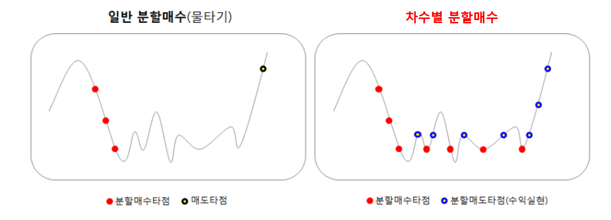

# 분할 투자 전략 최적화 (Split Investment Strategy Optimizer)

## 개요

이 프로젝트는 분할 투자 전략을 백테스팅하고 최적화하여 실제 투자에 적용하는 것을 목표로 합니다. 분할 투자 전략은 주식이나 ETF의 가격이 일정 비율로 하락할 때 분할 매수하고, 일정 비율로 상승할 때 분할 매도하는 전략입니다. 이를 통해 리스크를 관리하고 최적의 파라미터 조합을 찾아 최고의 성과를 내는 것을 목표로 합니다.

## 주요 기능

### 1. 주식 및 ETF 데이터 수집
- **주식 및 ETF 데이터 수집 스크립트**:
  - `src/ticker_collector.py`: 주식 티커 정보를 수집합니다.
  - `src/stock_data_collector.py`: 주식 가격 데이터를 수집하고 MySQL 데이터베이스에 저장합니다.
  - `src/etf_data_collector.py`: ETF 가격 데이터를 수집하고 MySQL 데이터베이스에 저장합니다.
    - PER, PBR, 배당수익률 등의 조건을 만족하는 주식만 저장합니다.
    - 상장폐지된 주식 및 조건을 만족하지 않는 주식을 필터링여부를 결정합니다.
    - 효율적인 업데이트를 위해 별도의 `ticker_status` 테이블을 사용합니다.

### 2. 분할 투자 전략 백테스팅
- **백테스팅 최적화기**:
  - `src/backtest_strategy.py`: 핵심 백테스팅 전략 및 로직이 포함되어 있습니다.
  - `src/single_backtest.py`: 단일 백테스팅 실행 스크립트입니다.
  - `src/parameter_simulation.py`: 여러 백테스팅을 병렬로 실행하여 최적의 파라미터를 찾는 스크립트입니다.

### 3. 데이터 파이프라인
- **데이터 파이프라인**:
  - `src/main_script.py`: 전체 데이터 수집 및 지표 계산 파이프라인(권장).
  - `src/data_pipeline.py`: 레거시 데이터 파이프라인(간단 수집용).
  - `src/db_setup.py`: 데이터베이스 설정 및 테이블 생성을 처리합니다.

### 4. 웹 인터페이스
- **Flask 애플리케이션**:
  - `src/app.py`: Flask 애플리케이션을 초기화하고 라우팅을 설정합니다.
  - `templates/index.html`: 웹 인터페이스 템플릿입니다.
  - `static/css/styles.css`: 웹 인터페이스를 위한 스타일 시트입니다.
  - `static/js/scripts.js`: 웹 인터페이스를 위한 자바스크립트 파일입니다.

### 5. GPU 가속
- `src/indicator_calculator_gpu.py`: GPU 기반 기술 지표 계산(옵션).
- `src/main_script.py`의 `USE_GPU` 플래그로 CPU/GPU 전환.
- GPU 사용 시 `cudf`, `cupy` 설치가 필요합니다.

## 설치 및 실행

### 1) 의존성 설치
- pip: `pip install -r requirement.txt`
- conda: `conda env create -f environment.yml`

### 2) 설정 파일
- 레거시 파이프라인/DB 유틸: `config.ini`에 MySQL 접속 정보를 설정합니다.
- 리팩토링 엔진/웹 UI/GPU 최적화: `config/config.yaml`을 사용합니다.
  - 예시 파일: `config/config.example.yaml`
  - 생성 예시: `cp config/config.example.yaml config/config.yaml`
- 실제 계정 정보는 로컬에서만 관리하고 공개 저장소에 커밋하지 않는 것을 권장합니다.

### 3) DB 테이블 생성
- `python -c "from src.db_setup import get_db_connection, create_tables; conn=get_db_connection(); create_tables(conn); conn.close()"`
- 또는 `python -m src.main_script` 실행 시 테이블이 자동 생성됩니다.

### 4) 목적별 실행 경로
- 데이터 파이프라인(권장): `python -m src.main_script` (파일 상단 플래그로 단계 제어)
- 레거시 파이프라인: `python src/data_pipeline.py`
- 레거시 분할 백테스트: `python src/single_backtest.py`
- 파라미터 스윕: `python src/parameter_simulation.py`
- 리팩토링 백테스트: `python -m src.main_backtest`

### 5) 웹 UI 실행
- 실행: `python -m src.app`
- 사전 준비: `DailyStockPrice`, `CalculatedIndicators`, `WeeklyFilteredStocks`, `CompanyInfo` 테이블이 채워져 있어야 합니다.
- 결과 파일은 `results/run_*/`에 저장됩니다.

## 기여 가이드 (Contributing)

### 프로젝트 구조
- `src/`: 핵심 Python 패키지
- `tests/`: 단위/통합 테스트 (`test_*.py`)
- `config/`: 설정 템플릿 (실제 설정은 gitignored)
- `templates/`, `static/`: Flask UI

### 코딩 스타일

**Python:**
- 4-space 들여쓰기
- 파일/함수명: `snake_case`, 클래스명: `CamelCase`
- 함수는 20줄 이내, 한 가지 일만 수행 (Single Responsibility)
- 인자 3개 이하 (초과 시 객체로 묶기)

**명명 규칙:**
- 의도를 드러내는 이름: `elapsed_time_in_days` (O), `d` (X)
- 무의미한 접두사/접미사, 약어 금지

**주석:**
- What이 아닌 Why 설명
- 코드로 설명 가능하면 주석 제거

### 테스트

```bash
# 전체 테스트
python -m unittest discover -s tests -p 'test_*.py'

# 단일 모듈 테스트
python -m unittest tests.test_portfolio
```

- 테스트는 결정적(deterministic)이어야 함
- DB/네트워크 접근은 가능한 mock 사용

### 커밋 규칙

Conventional Commits 형식:
```
<type>(<scope>): <description>

# 예시
feat(gpu): 메모리 기반 동적 배치 크기 계산 기능 추가
fix(#43): 추가 매수 로직 병렬화 버그 수정
docs: README.md 기여 가이드 추가
refactor(backtester): 포트폴리오 상태 관리 로직 개선
test: GPU 백테스터 단위 테스트 추가
```

**Type:** `feat`(새 기능), `fix`(버그 수정), `docs`(문서), `refactor`(리팩토링), `test`(테스트), `chore`(빌드/설정)

### PR 규칙
1. 명확한 설명 포함
2. 관련 이슈 링크 (`#NN`)
3. `config/` 또는 DB 스키마 변경 시 명시
4. UI 변경 시 스크린샷 첨부

### 보안
- `config/config.yaml`, `config.ini`는 gitignored - 로컬에서만 관리
- 결과물은 `results/`에 생성 (gitignored)
- 민감 정보(API 키, 비밀번호)는 절대 커밋 금지

## 분할 투자 전략 설명

분할 투자 전략은 주식이나 ETF의 가격이 일정 비율로 하락할 때 분할 매수하고, 일정 비율로 상승할 때 분할 매도하는 전략입니다. 이를 통해 리스크를 관리하고 일정한 수익을 목표로 합니다.
이 섹션의 공식은 `src/backtest_strategy.py`/`src/single_backtest.py` 기반(레거시) 흐름을 설명합니다.

각 주식은 `n`단계(`num_splits`)로 분할 매도 매수를 진행하며, 단계별 수익률은 다음과 같이 계산됩니다.

### 계산 방법
1. **추가 매수 하락률**:
    - **목표**: 각 단계별로 주가가 일정 비율 하락할 때 추가 매수를 진행합니다.
    - **공식**:
    ```python
    def calculate_additional_buy_drop_rate(last_buy_price, five_year_low, num_splits):
        return 1 - ((five_year_low / last_buy_price) ** (1 / (num_splits - 1)))
    ```

2. **매도 수익률**:
    - **목표**: 각 단계별로 주가가 일정 비율 상승할 때 매도를 진행합니다.
    - **공식**:
    ```python
    def calculate_sell_profit_rate(buy_profit_rate):
        return (1 / (1 - buy_profit_rate)) - 1
    ```

## 백테스팅 목표

백테스팅의 목표는 다양한 변수를 조정하여 여러 투자 기간 동안 평균 성과가 가장 좋은 조합을 도출하는 것입니다:
- **분할 단계 수 (`num_splits`)**: 주식당 최대 분할 가능한 횟수를 조정하여 가장 좋은 성과를 보이는 파라미터를 도출합니다.
    * 예: [10, 20, 30]
- **투자 비율 (`investment_ratio`)**: 전체 자본 중에서 각 단계별로 투입할 금액의 비율을 조정하여 가장 좋은 성과를 보이는 비율을 도출합니다. 실제로 각 단계별로 투입되는 금액은 `investment_ratio / num_splits`로 나눠집니다.
    * 예: [0.25, 0.3, 0.35]
- **초기 매수 기준 값 (`normalized value`)**: 5년 종가를 기준으로 최고가와 최저가를 통해 min-max 스케일링한 값을 조정하여 가장 좋은 성과를 보이는 기준 값을 도출합니다.
- **매수 임계값 (`buy_threshold`)**: 주식이 매수되는 기준이 되는 `normalized value`를 조정하여 가장 좋은 성과를 보이는 값을 도출합니다.
    * 예: [30, 40, 50]
- **PER 임계값 (`per_threshold`)**: 주식의 PER 값을 조정하여 조건을 만족하는 주식을 선택합니다.
    * 예: [5, 10, 15]
- **PBR 임계값 (`pbr_threshold`)**: 주식의 PBR 값을 조정하여 조건을 만족하는 주식을 선택합니다.
    * 예: [0.5, 1, 1.5]
- **배당 수익률 임계값 (`div_threshold`)**: 주식의 배당 수익률을 조정하여 조건을 만족하는 주식을 선택합니다.
    * 예: [1, 3]
- **추가 매수 하락률 (`min_additional_buy_drop_rate`)**: 추가 매수를 위한 하락률을 조정하여 가장 좋은 성과를 보이는 값을 도출합니다.
    * 예: [0.005, 0.015]
- **상장폐지 고려 여부 (`consider_delisting`)**: 상장폐지된 주식을 포함할지 여부를 설정합니다.
- **최대 보유 주식 수 (`max_stocks`)**: 포트폴리오에 포함될 최대 주식 수를 조정하여 가장 좋은 성과를 보이는 값을 도출합니다.
    * 예: [30, 45, 60]
- **랜덤 시드 (`seed`)**: 백테스팅의 일관성을 유지하기 위해 랜덤 시드를 고정합니다.

## 리팩토링 백테스트 파라미터(객체지향 엔진)
- `initial_cash`: 초기 자본
- `max_stocks`: 최대 보유 종목 수
- `order_investment_ratio`: 한 번 주문 시 투자 비율
- `additional_buy_drop_rate`: 추가 매수 트리거 하락률
- `sell_profit_rate`: 목표 매도 수익률
- `additional_buy_priority`: 추가 매수 우선순위(`lowest_order` 또는 `biggest_drop`)
- `cooldown_period_days`: 재진입 쿨다운(거래일)
- `stop_loss_rate`: 손절 기준 수익률
- `max_splits_limit`: 추가 매수 최대 단계
- `max_inactivity_period`: 비활성 기간 제한(거래일)
- 예시 실행: `python -m src.main_backtest` (파라미터는 `src/main_backtest.py`에서 설정)

## 사용된 주요 라이브러리 및 툴
- `pykrx`: 한국 거래소 데이터를 가져오기 위해 사용.
- `pymysql`: MySQL 데이터베이스와의 연동을 위해 사용.
- `pandas`, `numpy`: 데이터 조작 및 수치 연산.
- `matplotlib`, `seaborn`: 시각화.
- `sqlalchemy`, `mysql-connector-python`: DB 연결 및 ORM.
- `selenium`, `webdriver-manager`: 웹 자동화/스크래핑.
- `configparser`, `cryptography`: 설정 및 보안 관련 유틸리티.
- `tqdm`, `flask`: 진행률 표시 및 웹 인터페이스.

## 프로젝트 파일 설명

- **데이터 수집**:
  - `src/ticker_collector.py`: 주식 티커 정보를 수집합니다.
  - `src/stock_data_collector.py`: 주식 가격 데이터를 수집합니다.
  - `src/etf_data_collector.py`: ETF 가격 데이터를 수집합니다.
  - `src/main_script.py`: 전체 데이터 수집 및 지표 계산 파이프라인을 오케스트레이션합니다.
  - `src/data_pipeline.py`: 레거시 데이터 파이프라인 스크립트입니다.

- **백테스팅**:
  - `src/backtest_strategy.py`: 핵심 백테스팅 전략 및 로직이 포함되어 있습니다.
  - `src/single_backtest.py`: 단일 백테스팅 실행 스크립트입니다.
  - `src/parameter_simulation.py`: 최적의 파라미터 조합을 찾기 위해 여러 백테스팅을 실행합니다.

- **웹 인터페이스**:
  - `src/app.py`: Flask 애플리케이션을 초기화하고 라우팅을 설정합니다.
  - `templates/index.html`: 웹 인터페이스 템플릿입니다.
  - `static/css/styles.css`: 스타일 시트 파일입니다.
  - `static/js/scripts.js`: 자바스크립트 파일입니다.

- **데이터베이스 설정**:
  - `src/db_setup.py`: 데이터베이스 설정 및 테이블 생성을 처리합니다.

## 주요 업데이트 경과

- **2024년 6월 16일**: 데이터를 엑셀 파일 대신 MySQL에 저장하도록 변경.
- **2024년 6월 27일**: MySQL에서 데이터를 가져와 백테스팅하는 로직으로 변경.
    - 조건에 해당하는 종목을 찾기 위해 하드 코딩 대신 SQL을 사용하여 데이터를 동적으로 가져오도록 수정.
    - 조건을 만족하는 종목을 랜덤하게 선택하도록 설정.
- **2024년 7월 5일**: 백테스팅에 상장폐지 종목 포함.
    - 상장폐지 종목의 가치를 상장폐지 전날의 종가로 계산하고 포트폴리오에서 제거.
    - 10년 동안 상장폐지 종목을 포함한 백테스팅 결과, 평균 연평균 수익률 최대 11%.
    - 상장폐지 종목을 제외한 백테스팅 결과, 연평균 수익률 최대 16.5%.
- **2024년 7월 24일**: 백테스팅을 구현할 수 있는 Flask 웹페이지 개발

## 향후 계획 (로드맵)

GPU 가속 기반의 백테스팅 최적화 엔진 완성을 위한 개발 로드맵입니다.

---

### ✅ 에픽 0: 초기 설정 및 데이터 파이프라인 (완료)
- [x] #5 HTS 조건검색 결과 CSV 파일 파싱 로직 구현
- [x] #8 OHLCV 데이터 수집 및 DailyStockPrice DB 적재 기능 개발
- [x] #9 기술적/변동성 지표 계산 및 CalculatedIndicators DB 적재 기능 개발

---

### 🚀 에픽 1: GPU 가속 (진행 중)
*백테스팅 및 최적화 속도를 극적으로 향상시키기 위한 핵심 기반 작업입니다.*

- [x] #41 GPU 개발 환경 구축
- [x] #42 기술적 지표 계산 로직 GPU로 전환
- [ ] #43 파라미터 최적화 로직 병렬화 리팩토링
- [ ] #44 데이터 핸들러 GPU 호환성 확보

---

### 📊 에픽 2: 분석 및 사용성
*GPU로 얻은 결과를 의미있게 분석하고, 프로젝트 사용성을 높입니다.*

- [ ] #45 백테스트 성과 지표 상세 계산
- [ ] #46 최적화 결과 저장 및 리포트 생성
- [ ] #47 CLI(명령줄 인터페이스) 도입

---

### 📚 에픽 3: 문서화 및 유지보수
*누구나 프로젝트를 이해하고 기여할 수 있도록 프로젝트의 완성도를 높입니다.*

- [ ] #48 README.md 상세 문서화
- [ ] #49 코드 내 Docstring 작성

---

### 🧩 에픽 4: 전략 및 확장성
*장기적으로 다양한 전략을 쉽게 추가하고 실험할 수 있는 유연한 구조를 만듭니다.*

- [ ] #50 설정 기반 전략 로딩 구조로 리팩토링

## 연락처 정보

추가 정보나 프로젝트 논의를 원하시면 [datageeky7@gmail.com]로 연락해 주세요.
