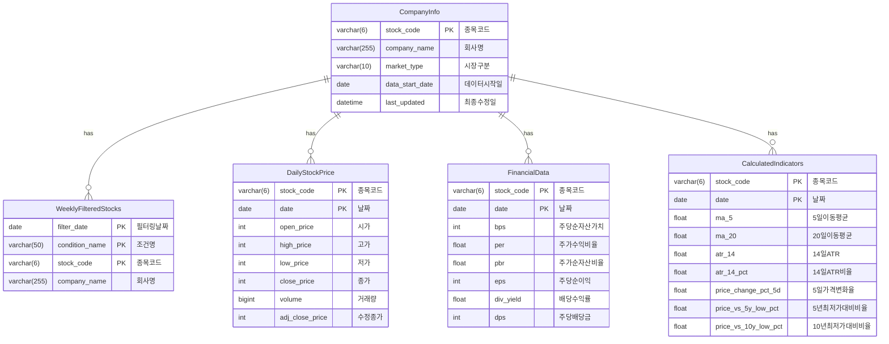

# 데이터베이스 스키마 정의서

## 1. `CompanyInfo` (종목 기본 정보 테이블)

*   **설명:** 국내 상장된 개별 종목의 기본 정보를 저장합니다. `company_info_manager.py`를 통해 주기적으로 업데이트됩니다.
*   **컬럼 상세:**

| 컬럼명             | 데이터 타입      | 제약 조건                | 설명                                                                  |
| :----------------- | :--------------- | :----------------------- | :-------------------------------------------------------------------- |
| `stock_code`       | `VARCHAR(6)`     | `PRIMARY KEY, NOT NULL`  | 종목 코드 (예: "005930")                                              |
| `company_name`     | `VARCHAR(255)`   | `NOT NULL`               | 종목명 (예: "삼성전자")                                                 |
| `market_type`      | `VARCHAR(10)`    | `NULL`                   | 시장 구분 (예: "KOSPI", "KOSDAQ", "KONEX")                            |
| `data_start_date`  | `DATE`           | `NULL`                   | `pykrx`에서 수집 가능한 가장 오래된 OHLCV 데이터의 날짜 (근사 상장일) |
| `last_updated`     | `DATETIME`       | `NOT NULL`               | 해당 레코드의 마지막 업데이트 시각                                        |

*   **인덱스:**
    *   `idx_company_info_company_name` ON `company_name` (종목명으로 검색 시 효율 향상)

## 2. `WeeklyFilteredStocks` (주간 조건검색 필터링 결과 테이블)

*   **설명:** 매주 금요일 HTS 조건검색을 통해 필터링된 종목 리스트를 저장합니다. `hts_csv_parser.py`를 통해 적재됩니다.
*   **컬럼 상세:**

| 컬럼명             | 데이터 타입    | 제약 조건                                                              | 설명                                                                  |
| :----------------- | :------------- | :--------------------------------------------------------------------- | :-------------------------------------------------------------------- |
| `filter_date`      | `DATE`         | `PRIMARY KEY, NOT NULL`                                                | 필터링 기준일 (해당 주의 금요일 날짜, 예: "2014-11-17")                |
| `condition_name`   | `VARCHAR(50)`  | `PRIMARY KEY, NOT NULL`                                                | 사용된 조건검색식 이름 (예: "FinancialSafetyFilter_v1")               |
| `stock_code`       | `VARCHAR(6)`   | `PRIMARY KEY, NOT NULL, FOREIGN KEY REFERENCES CompanyInfo(stock_code)`  | 필터링된 종목 코드                                                      |
| `company_name`     | `VARCHAR(255)` | `NOT NULL`                                                             | 필터링된 종목명 (참고용, 실제 조회 시 `CompanyInfo`와 조인 권장)       |

*   **인덱스:** 없음 (복합 기본 키가 이미 인덱스 역할을 수행)

## 3. `DailyStockPrice` (일별 주가 데이터 테이블)

*   **설명:** `WeeklyFilteredStocks`에 포함된 종목들의 과거 및 현재 일별 OHLCV 데이터를 `pykrx`를 통해 수집하여 저장합니다.
*   **컬럼 상세:**

| 컬럼명             | 데이터 타입    | 제약 조건                                                              | 설명                                                        |
| :----------------- | :------------- | :--------------------------------------------------------------------- | :---------------------------------------------------------- |
| `stock_code`       | `VARCHAR(6)`   | `PRIMARY KEY, NOT NULL, FOREIGN KEY REFERENCES CompanyInfo(stock_code)`  | 종목 코드                                                   |
| `date`             | `DATE`         | `PRIMARY KEY, NOT NULL`                                                | 기준일자                                                    |
| `open_price`       | `INTEGER`      | `NOT NULL`                                                             | 시가                                                        |
| `high_price`       | `INTEGER`      | `NOT NULL`                                                             | 고가                                                        |
| `low_price`        | `INTEGER`      | `NOT NULL`                                                             | 저가                                                        |
| `close_price`      | `INTEGER`      | `NOT NULL`                                                             | 종가                                                        |
| `volume`           | `BIGINT`       | `NOT NULL`                                                             | 거래량                                                      |
| `adj_close_price`  | `INTEGER`      | `NULL`                                                                 | 수정 종가 (액면분할/병합, 배당 등 반영 시. 초기에는 NULL 가능) |

*   **인덱스:** 없음 (복합 기본 키가 이미 인덱스 역할을 수행)

## 4. `FinancialData` (일별 재무 지표 테이블)

*   **설명:** `WeeklyFilteredStocks`에 포함된 종목들의 일별 주요 재무 지표를 `pykrx`를 통해 수집하여 저장합니다. (`get_market_fundamental` 함수 활용)
*   **컬럼 상세:**

| 컬럼명        | 데이터 타입    | 제약 조건                                                              | 설명                                                                  |
| :------------ | :------------- | :--------------------------------------------------------------------- | :-------------------------------------------------------------------- |
| `stock_code`  | `VARCHAR(6)`   | `PRIMARY KEY, NOT NULL, FOREIGN KEY REFERENCES CompanyInfo(stock_code)`  | 종목 코드                                                               |
| `date`        | `DATE`         | `PRIMARY KEY, NOT NULL`                                                | 기준일자 (매일)                                                         |
| `bps`         | `INTEGER`      | `NULL`                                                                 | BPS (주당순자산)                                                        |
| `per`         | `FLOAT`        | `NULL`                                                                 | PER (주가수익비율)                                                      |
| `pbr`         | `FLOAT`        | `NULL`                                                                 | PBR (주가순자산비율)                                                      |
| `eps`         | `INTEGER`      | `NULL`                                                                 | EPS (주당순이익)                                                        |
| `div_yield`   | `FLOAT`        | `NULL`                                                                 | DIV (배당수익률, `pykrx` 컬럼명: DIV)                                |
| `dps`         | `INTEGER`      | `NULL`                                                                 | DPS (주당배당금, `pykrx` 컬럼명: DPS)                                 |

*   **인덱스:** 없음 (복합 기본 키가 이미 인덱스 역할을 수행)

## 5. `CalculatedIndicators` (계산된 기술적/변동성 지표 테이블)

*   **설명:** `DailyStockPrice` 데이터를 기반으로 백테스팅에 필요한 각종 기술적 지표 및 변동성 지표를 미리 계산하여 저장합니다.
*   **컬럼 상세:**

| 컬럼명                   | 데이터 타입   | 제약 조건                                                              | 설명                                                                          |
| :----------------------- | :------------ | :--------------------------------------------------------------------- | :---------------------------------------------------------------------------- |
| `stock_code`             | `VARCHAR(6)`  | `PRIMARY KEY, NOT NULL, FOREIGN KEY REFERENCES CompanyInfo(stock_code)`  | 종목 코드                                                                       |
| `date`                   | `DATE`        | `PRIMARY KEY, NOT NULL`                                                | 기준일자                                                                        |
| `ma_5`                   | `FLOAT`       | `NULL`                                                                 | 5일 이동평균 (종가 기준)                                                          |
| `ma_20`                  | `FLOAT`       | `NULL`                                                                 | 20일 이동평균 (종가 기준)                                                         |
| `atr_14`                 | `FLOAT`       | `NULL`                                                                 | 14일 ATR (Average True Range)                                                 |
| `atr_14_pct`             | `FLOAT`       | `NULL`                                                                 | 14일 ATR 비율 (ATR / 종가 * 100)                                              |
| `price_change_pct_5d`    | `FLOAT`       | `NULL`                                                                 | 최근 5일간 주가 변동률                                                            |
| `price_vs_5y_low_pct`  | `FLOAT`       | `NULL`                                                                 | 5년(거래일 기준 약 1260일) 최저가 대비 현재 종가의 상대 위치 비율              |
| `price_vs_10y_low_pct` | `FLOAT`       | `NULL`                                                                 | 10년(거래일 기준 약 2520일) 최저가 대비 현재 종가의 상대 위치 비율             |

*   **인덱스:** 없음 (복합 기본 키가 이미 인덱스 역할을 수행)

---

**ERD (Entity-Relationship Diagram) 참고:**

(이 부분에는 `dbdiagram.io` 등으로 그린 ERD 이미지를 첨부하거나, Mermaid.js 코드를 삽입할 수 있습니다.)

**Mermaid.js 코드 (간략화):**

