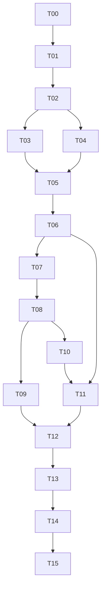
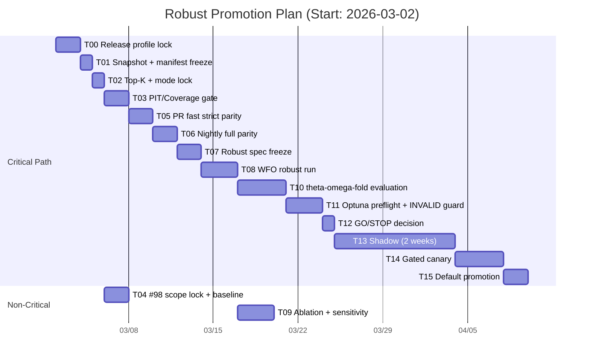

# Robust Parameter Promotion PERT/CPM Plan

Last Updated: 2026-03-01  
Related: `#56`, `#67`, `#68`, `#98`, `#101`

## 1) 저장 형식 결정

권장 저장 형식은 `Markdown + Mermaid`이다.

1. `Markdown`:
   - 리뷰/PR diff 추적이 쉽고, 결정 배경/게이트/리스크를 한 문서에서 관리 가능
   - `TODO.md` 및 `todos/*`와 링크 연결이 자연스러움
2. `Mermaid`:
   - 네트워크(선후행)와 일정(Gantt)을 코드로 버전관리 가능
   - 이미지 산출물 없이 문서 내에서 바로 시각화 가능
3. 보조 형식:
   - PM 도구 import가 필요할 때만 CSV 병행(본 문서와 동일 기준)

본 계획은 위 원칙에 따라 `MD(SSOT) + CSV(보조)`로 저장한다.

## 2) 공통 제약(모든 태스크 적용)

1. `CPU=SSOT`
2. `PIT/no-lookahead` 위반 금지
3. `candidate_source_mode=tier` 고정
4. `#98` 성능 변경은 `PC/PO` 분류 후 `#56` strict parity 재게이트 필수

현재 실행 트랙(2026-03-02 결정):
- `T00` 기준 프로파일은 `optimistic_survivor + tier + raise + strict`로 잠근다.
- 본 트랙 결과는 탐색/선별용이며, 승격 판단 전 `strict_pit` 재검증 단계를 별도로 둔다.

## 3) PERT Task Table

`TE = (O + 4M + P) / 6`

| ID | Task | Pred | O | M | P | TE | Gate/Deliverable |
|---|---|---|---:|---:|---:|---:|---|
| T00 | Release profile lock (`optimistic_survivor`, `tier`, `raise`, `strict`) | - | 1.0 | 2.0 | 3.0 | 2.00 | exploratory profile lock + run manifest tag |
| T01 | `parameter_simulation` 결과 + manifest 동결 | T00 | 0.5 | 1.0 | 1.5 | 1.00 | simulation CSV + `config/data/env/git hash` |
| T02 | Top-K 추출 + tier 모드 고정 검증 | T01 | 0.5 | 1.0 | 2.0 | 1.08 | `topk_params.csv`, mode 고정 로그 |
| T03 | PIT/coverage/liquidity 게이트 재검증 | T02 | 1.0 | 2.0 | 3.0 | 2.00 | `tier_coverage_report`, gate report |
| T04 | #98 Scope lock(PC/PO) + baseline | T02 | 1.0 | 1.5 | 3.0 | 1.67 | PC/PO 매핑표, baseline(B0) |
| T05 | PR fast strict parity gate | T03,T04 | 1.0 | 2.0 | 3.0 | 2.00 | strict parity `mismatch=0` |
| T06 | Nightly full parity + event dump | T05 | 1.0 | 2.0 | 4.0 | 2.17 | full gate `mismatch_pairs=0` |
| T07 | #68 robust score/hard gate spec 확정 | T06 | 1.0 | 2.0 | 3.0 | 2.00 | `median(OOS/IS)`, `fold_pass_rate`, `MDD p95` 확정 |
| T08 | WFO robust 선발 실행 | T07 | 2.0 | 3.0 | 5.0 | 3.17 | `wfo_robust_parameters.csv` + fold cluster |
| T09 | Ablation/민감도/집중도(HHI) 검증 | T08 | 1.5 | 3.0 | 4.0 | 2.92 | ablation matrix + sensitivity + concentration |
| T10 | `theta x omega x fold` 분포평가 | T08 | 2.0 | 4.0 | 6.0 | 4.00 | scenario 분포 결과셋 |
| T11 | Optuna preflight/INVALID/manifest 자동화 | T06,T10 | 1.5 | 2.5 | 4.0 | 2.58 | `INVALID_*` 분류 + preflight pass |
| T12 | 승격 후보 shortlist + GO/STOP | T09,T11 | 0.5 | 1.0 | 2.0 | 1.08 | `promotion_decision.md` |
| T13 | Shadow 2주 운영 검증 | T12 | 8.0 | 10.0 | 14.0 | 10.33 | 2주 shadow metrics pass |
| T14 | Gated canary 승격 | T13 | 2.0 | 4.0 | 6.0 | 4.00 | canary report + rollback trigger check |
| T15 | Default 승격 + rollback 증적 | T14 | 1.0 | 2.0 | 3.0 | 2.00 | 승격 PR + rollback runbook + parity snapshot |

## 4) CPM 결과

1. Critical Path:
   - `T00 -> T01 -> T02 -> T03 -> T05 -> T06 -> T07 -> T08 -> T10 -> T11 -> T12 -> T13 -> T14 -> T15`
2. Expected Duration:
   - `39.42`일 (TE 기준)
3. Slack:
   - `T04`: `0.33`일
   - `T09`: `3.67`일

## 5) 주차별 실행계획 (기준 시작일: 2026-03-02)

| Week | 기간 | 핵심 태스크 | 주간 Exit Gate |
|---|---|---|---|
| W1 | 2026-03-02 ~ 2026-03-08 | T00,T01,T02,T03(착수) | exploratory profile lock + simulation manifest 동결 |
| W2 | 2026-03-09 ~ 2026-03-15 | T03(완료),T04,T05,T06 | strict parity fast/nightly pass |
| W3 | 2026-03-16 ~ 2026-03-22 | T07,T08 | robust spec 확정 + WFO robust 실행 완료 |
| W4 | 2026-03-23 ~ 2026-03-29 | T09,T10,T11 | 분포평가 + INVALID 분류 자동화 완료 |
| W5 | 2026-03-30 ~ 2026-04-05 | T12 + T13(시작) | GO/STOP 판정 + shadow 시작 |
| W6 | 2026-04-06 ~ 2026-04-12 | T13(지속) | shadow 중간점검(`entry/coverage/parity`) |
| W7 | 2026-04-13 ~ 2026-04-19 | T13(완료),T14(시작) | shadow 최종 통과 + canary 착수 |
| W8 | 2026-04-20 ~ 2026-04-26 | T14(완료),T15 | default 승격/rollback 증적 완료 |

## 6) Mermaid (Network)

## 7) Mermaid (Gantt, TE 반올림 일수)

## 8) 운영 차단/강등 규칙

1. `parity mismatch > 0`:
   - 즉시 `default -> gated` 강등, 원인 분류 후 strict 재검증
2. `PIT 위반` (`future_rows`, `duplicate_like_rows`, `staleness`):
   - 해당 배치/승격 즉시 중단, 데이터 재적재 후 재검증
3. `repro 불일치` (manifest hash mismatch):
   - 결과 무효 처리, 동일 manifest로 재실행
4. `shadow 지표 악화`:
   - `gated -> shadow` 강등, 2주 재관찰 후 재판정
